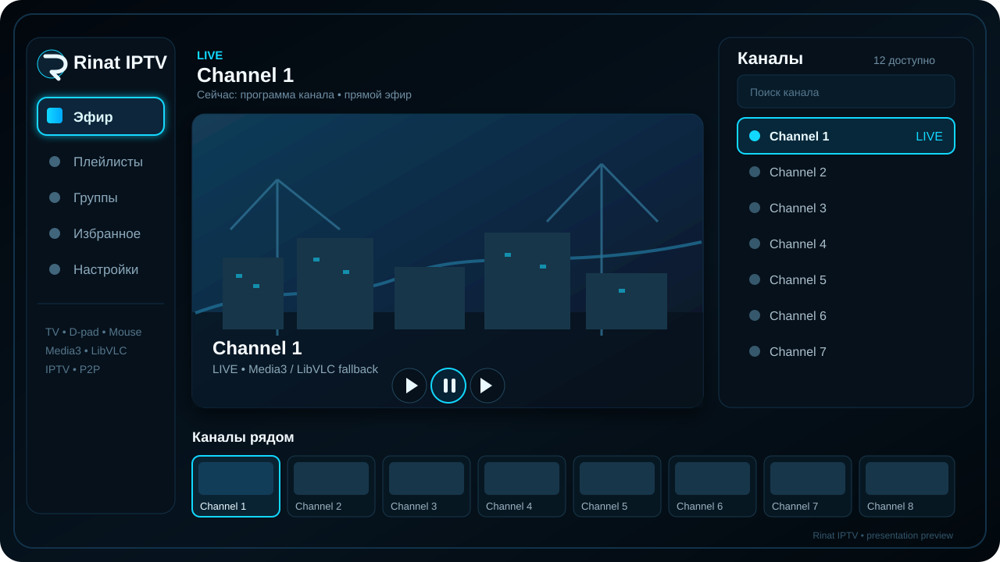

# Rinat IPTV

**Rinat IPTV** — Android TV / TV Box приложение для просмотра IPTV с интерфейсом, рассчитанным на телевизор, пульт и мышь. Проект активно развивается: обычное IPTV, BitTorrent и автономный Ace Live имеют собственные встроенные маршруты. Главный технический приоритет — довести собственный Torrent TV/Ace Live runtime до быстрого и устойчивого воспроизведения без внешнего Ace Stream Engine.

<p align="center">
  
</p>

<p align="center"><em>Презентационный вид направления интерфейса плеера: крупное видео, навигация слева, каналы справа и быстрый выбор снизу.</em></p>

## Возможности

- **Просмотр IPTV** из M3U/M3U8-плейлистов и сохранённых списков каналов.
- **Готовые списки и ручной импорт**: URL, локальный файл, текст и поддерживаемые провайдерские источники.
- **Сканер публичных источников** для поиска новых плейлистов с последующим просмотром и импортом найденных результатов.
- **Редактор каналов и плейлистов**: работа со списками, группами и подгруппами без необходимости редактировать M3U вручную.
- **Канонический каталог плейлистов**: путь `Источник → Плейлист → Группа/Подгруппа → Канал`, breadcrumb-контекст, Back ровно на один уровень и открытие точного выбранного канала в Player.
- **Стабильное восстановление focus каталога**: после возврата из Player приложение возвращает пользователя к прежнему уровню/строке по стабильному canonical id; после обновления дерева используется самый глубокий оставшийся корректный путь.
- **Избранное, история и EPG**: быстрый доступ к сохранённым каналам, истории просмотра и программе передач, когда она доступна у источника. Полная unified Favorites persistence для всех источников остаётся отдельным roadmap-этапом.
- **Media3 / ExoPlayer как основной плеер** с изолированным **LibVLC fallback** для подтверждённых container/demux/codec несовместимостей.
- **Встроенный BitTorrent/P2P backend** для `magnet:`, infohash, локальных `.torrent` и HTTP(S)-ссылок на `.torrent`; поток для плеера отдаётся через локальный HTTP Range.
- **Собственный встроенный Ace Live backend**: tracker/DHT discovery, peer lifecycle, live-window/chunk scheduling, recovery и локальная MPEG-TS выдача. Torrent TV не требует внешнего Ace Engine.
- **Полный Torrent TV каталог**: временная P2P-доступность показывается как статус и не скрывает канал из пользовательского выбора.
- **Управление с телевизора**: D-pad, Enter/Center, PageUp/PageDown, ChannelUp/ChannelDown, мышь, колесо, тачпад и сенсорный экран.
- **TV-first оформление**: в тёмном режиме используется сине-чёрная палитра с голубым акцентом и хорошо заметным focus; светлая системная тема также поддерживается.
- **TV-friendly навигация**: возврат focus после меню и диалогов, прокрутка сфокусированного элемента в видимую область.
- **Полноэкранный просмотр**, автоскрытие элементов управления и адаптивные playback policies для TV Box.
- **Встроенная справка** в разделе «О приложении» и подробный [`docs/USER_GUIDE.md`](docs/USER_GUIDE.md).
- **Диагностика и техническая информация** для проверки сети, playback/P2P маршрута и причин fallback.
- **Экспорт и обслуживание данных**: сохранение списков и очистка устаревших/ошибочных данных через предусмотренные экраны приложения.

## Быстрый старт

После запуска откройте **«Смотреть ТВ»**:

1. выберите сохранённый список каналов; или
2. откройте один из готовых списков — приложение загрузит его и перейдёт к просмотру;
3. для добавления своих источников используйте импорт;
4. если нужны новые публичные списки, откройте Scanner и импортируйте подходящий результат;
5. в **«Мои плейлисты»** выберите список и нажмите **«Открыть каталог»**, чтобы пройти по группам к конкретному каналу с сохранением breadcrumb и focus.

## Каталог и навигация

Пользовательская canonical navigation часть закрыта PR #167 и #168. Реальный экран «Мои плейлисты» связывает сохранённые каналы с каноническим деревом каталога.

- контейнеры открывают следующий уровень иерархии;
- канал является leaf и передаёт в Player конкретные `playlistId + channelId`;
- аппаратная Back, верхняя кнопка «Назад» и кнопка каталога используют one-level Back semantics;
- focus хранится по стабильному `CatalogNodeId`, а длинный список прокручивается к восстанавливаемой строке;
- после rebuild плейлиста невалидные участки пути отбрасываются, а пользователь остаётся на самом глубоком существующем уровне.

Подробный пользовательский сценарий: [`docs/USER_GUIDE.md`](docs/USER_GUIDE.md).

## Статус P2P / Torrent TV

Ordinary BitTorrent обслуживается встроенным libtorrent/libtorrent4j backend: metadata, streaming priorities, read-ahead/seek и локальная HTTP Range выдача.

Ace Live обрабатывается отдельным собственным runtime. `content_id`, live swarm identity и ordinary BitTorrent BTIH не смешиваются. Runtime выполняет bounded tracker/DHT discovery, Ace peer handshake, live-window scheduling, chunk/piece reassembly, recovery и выдаёт MPEG-TS через `127.0.0.1` плееру.

**Внешний Ace Stream Engine не является целевым backend или fallback для Torrent TV.** Разработка собственного движка — основной приоритет проекта. Сторонние решения используются только как benchmark: на одинаковом канале/устройстве сравниваются время запуска, rebuffer, recovery и длительная стабильность.

Текущий этап — **Ace Live adaptive streaming core**. По полевым TV Box логам найдено, что обнаруженные DHT/tracker endpoints ещё не гарантируют media-producing peers, а старая startup-buffer оценка включала discovery latency в media rate и могла открыть поток с недостаточным запасом. В первой версии adaptive prebuffer throughput clock перенесён на first-media, добавлен EWMA и усилены startup reserve rules. Далее идут producing-peer accounting, buffer watermarks, adaptive request depth и отдельная telemetry loopback/Media3.

Подробности:

- [`docs/ACE_LIVE_ADAPTIVE_STREAMING_CORE.md`](docs/ACE_LIVE_ADAPTIVE_STREAMING_CORE.md) — текущая архитектурная цель;
- [`docs/PLAYBACK_STATUS.md`](docs/PLAYBACK_STATUS.md) — подтверждённые результаты и blockers;
- [`docs/ROADMAP.md`](docs/ROADMAP.md) — порядок разработки и acceptance.

## Требования

- JDK 17;
- Android SDK 35;
- Android 7.0+ (`minSdk 24`).

## Сборка

Windows PowerShell:

```powershell
$env:JAVA_HOME="C:\\Program Files\\Android\\Android Studio\\jbr"
.\\gradlew.bat --no-daemon assembleDebug
```

Linux:

```bash
JAVA_HOME=/usr/lib/jvm/java-17-openjdk-amd64 ./gradlew --no-daemon assembleDebug
```

APK создаётся стандартно:

```text
app/build/outputs/apk/debug/app-debug.apk
app/build/outputs/apk/release/
```

APK/AAB не хранятся в Git. GitHub Actions прикладывает сборки к успешным запускам workflow.

## Проверка

Основной workflow `.github/workflows/android.yml` выполняет:

- Android lint;
- unit-тесты модулей, включая постоянный `:feature:playlists:testDebugUnitTest` gate для canonical catalog navigation;
- компиляцию Android instrumentation tests;
- `assembleDebug`;
- release/ARM APK сборки;
- real Torrent TV playback smoke для P2P/runtime изменений без внешнего Ace Engine;
- публикацию APK и отчётов как временных GitHub Actions artifacts.

## Документация

Актуальная документация находится в [`docs/README.md`](docs/README.md).  
Руководство пользователя — в [`docs/USER_GUIDE.md`](docs/USER_GUIDE.md).  
Текущий статус воспроизведения — в [`docs/PLAYBACK_STATUS.md`](docs/PLAYBACK_STATUS.md).  
План развития — в [`docs/ROADMAP.md`](docs/ROADMAP.md).

## Автор

**Rinat Sarmuldin**  
`ura07srr@gmail.com`

## Лицензия

Проект распространяется на условиях файла [`LICENSE`](LICENSE). Лицензии сторонних компонентов сохранены в `docs/legal/`.
